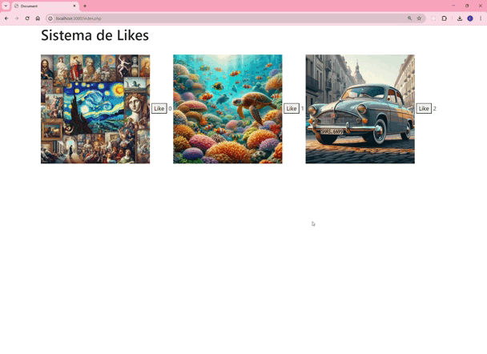

   

 

  

Este código te permite dar like a una imagen

Se emplea AJAX para no recargar la página a cada like

El like se guarda en la base de datos

Por lo que tiene en cuenta el id de un usuario concreto

    

 

  <h3  align="center">
    <pre>💻Hecho con PHP🐘 y 💝 </pre>
  <h3/>

  <a href="https://www.linkedin.com/in/emmily-santos-a6851327b?utm_source=share&utm_campaign=share_via&utm_content=profile&utm_medium=android_app">Linkedin</a>
